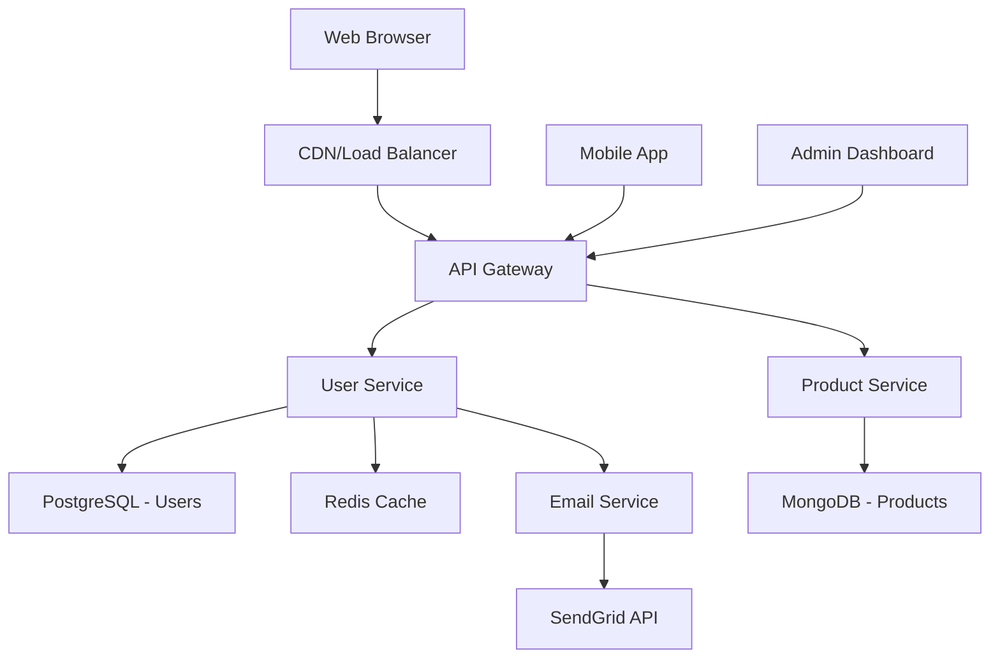
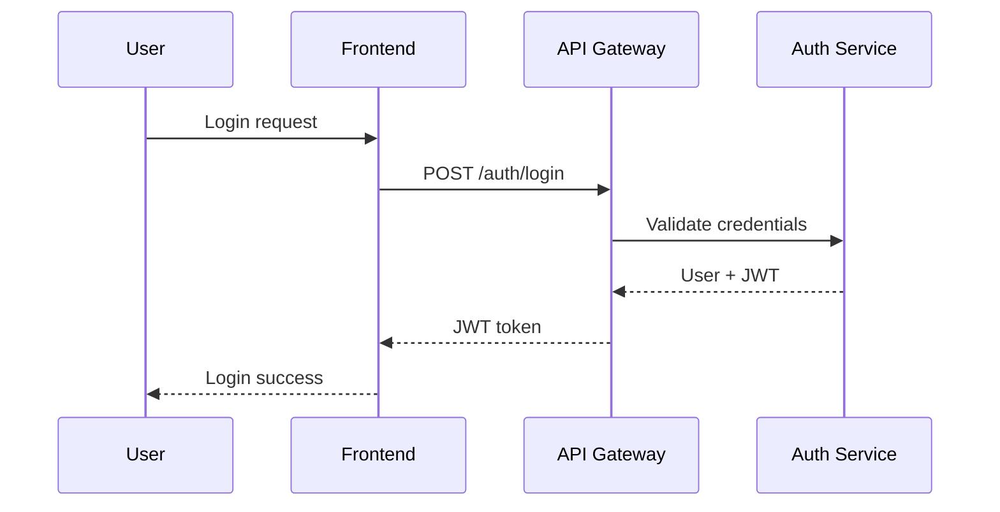

# Common Interfaces: [Festival Name]

## Purpose

This document defines all system interfaces that must be established and finalized during **Phase 002: DEFINE_INTERFACES** before **Phase 003: IMPLEMENT** begins. This is the most critical step for enabling parallel development.

**Location in Festival Structure**: This file lives at the root of the festival directory and is updated throughout the interface definition phase based on work completed in `002_DEFINE_INTERFACES/`.

## Interface Definition Status

**Current Status**: [DRAFT | UNDER_REVIEW | FINALIZED]

**Review Deadline**: [Date when interfaces must be finalized]

**Stakeholder Sign-off Required**: [List of roles/people who must approve]

---

## Step 1: System Architecture Overview

### High-Level System Components

| Component | Responsibility | Technology Stack | Dependencies |
|-----------|---------------|------------------|-------------|
| [Component Name] | [What it does] | [Tech choices] | [What it needs] |
| Frontend Web App | User interface, state management | React, TypeScript | API Gateway, CDN |
| API Gateway | Request routing, authentication | Express.js, JWT | User Service, Product Service |
| User Service | Authentication, user management | Node.js, PostgreSQL | Email Service, Cache |
| Product Service | Catalog, inventory management | Python, MongoDB | Search Service, Image Service |
| Email Service | Transactional emails | SendGrid API | Template Storage |

### System Boundaries and Data Flow

### External System Dependencies

| System | Purpose | Protocol | SLA Requirements |
|--------|---------|----------|------------------|
| [System Name] | [What we use it for] | [How we connect] | [Uptime/Performance] |
| SendGrid | Transactional emails | HTTPS/REST | 99.95% uptime, <2s response |
| Stripe | Payment processing | HTTPS/REST | 99.99% uptime, <1s response |
| AWS S3 | File storage | HTTPS/REST | 99.9% uptime, <500ms response |
| Redis Cloud | Session storage | Redis Protocol | 99.99% uptime, <10ms response |

---

## Step 2: Communication Protocol Selection

### Internal Service Communication

**Selected Protocol**: [REST/GraphQL/gRPC/Message Queue/Custom]

**Rationale**: [Why this protocol was chosen for internal communication]

| Service Pair | Protocol | Justification | Fallback Strategy |
|--------------|----------|---------------|-------------------|
| Frontend ↔ API Gateway | REST over HTTPS | Standard web protocol, caching support | N/A - direct dependency |
| API Gateway ↔ User Service | gRPC | High performance, type safety | HTTP/JSON fallback |
| API Gateway ↔ Product Service | REST | Simpler debugging, HTTP caching | N/A |
| User Service → Email Service | Message Queue | Async, retry handling | Direct HTTP call |

### External Integration Protocols

| Integration | Protocol | Authentication | Rate Limits | Error Handling |
|-------------|----------|---------------|-------------|----------------|
| [Service Name] | [Protocol] | [Auth method] | [Limits] | [Strategy] |
| SendGrid | HTTPS/REST | Bearer Token | 600 req/min | Retry with backoff |
| Stripe | HTTPS/REST | Bearer Token | 100 req/sec | Idempotency keys |
| OAuth Provider | OAuth 2.0/OIDC | Client Secret | Provider limits | Graceful degradation |

---

## Step 3: Data Architecture & Schemas

### Core Data Entities

| Entity | Purpose | Primary Storage | Relationships | Access Patterns |
|--------|---------|----------------|---------------|------------------|
| [Entity Name] | [What it represents] | [Where stored] | [Connections] | [How accessed] |
| User | Identity and profile | PostgreSQL | 1:N with Orders | By ID, By email |
| Product | Catalog items | MongoDB | M:N with Categories | By ID, Search, Filter |
| Order | Purchase records | PostgreSQL | N:1 with User, M:N with Products | By User, By date range |
| Session | User state | Redis | 1:1 with User | By session token |

### Data Consistency Requirements

| Operation | Consistency Level | Justification | Fallback Strategy |
|-----------|------------------|---------------|-------------------|
| [Operation] | [Strong/Eventual/Weak] | [Why] | [What if fails] |
| User Registration | Strong | Critical for auth | Manual cleanup |
| Product Catalog Updates | Eventual | Can tolerate brief inconsistency | Retry mechanism |
| Payment Processing | Strong | Financial accuracy required | Transaction rollback |
| Session Management | Weak | Can recreate if lost | Force re-login |

---

## Step 4: Interface Contracts

### Service Interface Definitions

#### [Service Name] Interface

**Purpose**: [What this service does]

**Communication Method**: [Protocol choice from Step 2]

**Operations Table**:

| Operation | Input | Output | Error Cases | Performance SLA |
|-----------|-------|--------|-------------|------------------|
| [Operation Name] | [Input description] | [Output description] | [Error scenarios] | [Response time] |
| Create User | User registration data | User ID + session token | Email exists, Invalid data | <200ms |
| Authenticate | Email + password | User profile + JWT | Invalid credentials, Account locked | <100ms |
| Get User Profile | User ID | User profile data | User not found, Unauthorized | <50ms |
| Update Profile | User ID + changes | Updated profile | Validation errors, Unauthorized | <150ms |

**Data Contracts**:

| Field | Type | Required | Validation | Default |
|-------|------|----------|------------|----------|
| [Field Name] | [Data Type] | [Y/N] | [Rules] | [Default Value] |
| userId | UUID | Yes | Valid UUID format | N/A |
| email | String | Yes | Email regex, Unique | N/A |
| firstName | String | Yes | 1-50 chars, Letters only | N/A |
| lastName | String | Yes | 1-50 chars, Letters only | N/A |
| phoneNumber | String | No | E.164 format | null |

### API Endpoint Specifications

#### [Endpoint Name]

**Purpose**: [What this endpoint does]

**HTTP Method**: [GET/POST/PUT/DELETE]

**URL Pattern**: [/path/with/{parameters}]

**Request Format**:

| Parameter | Location | Type | Required | Description |
|-----------|----------|------|----------|-------------|
| [param] | [path/query/header/body] | [type] | [Y/N] | [description] |
| userId | path | UUID | Yes | User identifier |
| Authorization | header | String | Yes | Bearer JWT token |
| limit | query | Integer | No | Max results (default: 50) |

**Response Format**:

| Status Code | Content Type | Structure | Description |
|-------------|--------------|-----------|-------------|
| [Code] | [Type] | [Format] | [When returned] |
| 200 | application/json | User profile object | Success |
| 401 | application/json | Error object | Invalid/expired token |
| 404 | application/json | Error object | User not found |
| 429 | application/json | Error object | Rate limit exceeded |

---

## Step 5: Event & Message Contracts

### Event-Driven Communication

**Message Broker**: [Kafka/RabbitMQ/AWS SQS/Custom]

**Event Schema Standard**: [JSON/Avro/Protobuf]

#### Event Catalog

| Event Name | Publisher | Subscribers | Trigger Condition | Payload Schema | Delivery Guarantee |
|------------|-----------|-------------|-------------------|----------------|--------------------|
| [Event] | [Service] | [Services] | [When sent] | [Data format] | [At least once/Exactly once] |
| UserRegistered | User Service | Email Service, Analytics | Successful user creation | User profile + metadata | At least once |
| OrderPlaced | Order Service | Inventory, Shipping, Email | Payment confirmed | Order details + items | Exactly once |
| PaymentFailed | Payment Service | User Service, Analytics | Payment declined | Payment attempt + reason | At least once |

### Message Queue Specifications

| Queue Name | Purpose | Message Format | Consumer Count | Dead Letter Queue |
|------------|---------|---------------|----------------|-------------------|
| [Queue] | [Purpose] | [Format] | [Consumers] | [DLQ Strategy] |
| user.registration | Process new users | JSON | 3 workers | After 3 retries |
| email.transactional | Send emails | JSON | 5 workers | Manual review queue |
| order.processing | Process orders | JSON | 2 workers | Alert + retry |

---

## Step 6: Security & Authentication Contracts

### Authentication Flow

### Authorization Matrix

| Resource | Anonymous | User | Admin | System |
|----------|-----------|------|-------|--------|
| [Resource] | [Permissions] | [Permissions] | [Permissions] | [Permissions] |
| User Profile | None | Own profile only | All profiles | All profiles |
| Product Catalog | Read only | Read only | Read/Write | Read/Write |
| Orders | None | Own orders | All orders | All orders |
| System Config | None | None | Read/Write | Read/Write |

### Security Requirements

| Aspect | Requirement | Implementation | Validation |
|--------|-------------|---------------|------------|
| [Security Area] | [Requirement] | [How achieved] | [How verified] |
| Data Encryption | All PII encrypted at rest | AES-256 database encryption | Quarterly security audit |
| Transport Security | All external traffic HTTPS | TLS 1.3 minimum | SSL Labs A+ rating |
| Authentication | MFA for admin accounts | TOTP or SMS | Penetration testing |
| Session Management | 24-hour session timeout | JWT with expiry | Automated testing |

---

## Step 7: Performance & Scalability Contracts

### Performance Requirements

| Service/Endpoint | Response Time (p95) | Throughput (RPS) | Availability | Error Rate |
|------------------|--------------------|-----------------|--------------|-----------|
| [Service/Endpoint] | [Time] | [Requests] | [Uptime] | [Max errors] |
| User Authentication | 100ms | 1000 | 99.99% | <0.1% |
| Product Search | 200ms | 500 | 99.9% | <0.5% |
| Order Processing | 500ms | 100 | 99.95% | <0.01% |
| File Upload | 2s | 50 | 99.9% | <1% |

### Scalability Planning

| Component | Current Capacity | Scale Trigger | Scale Method | Max Capacity |
|-----------|------------------|---------------|--------------|---------------|
| [Component] | [Current] | [When to scale] | [How to scale] | [Limit] |
| API Servers | 5 instances | >70% CPU | Horizontal (auto-scaling) | 50 instances |
| Database | Single instance | >80% connections | Read replicas | 1 primary + 5 read replicas |
| Cache | 2GB Redis | >75% memory | Vertical scaling | 32GB |
| File Storage | 100GB | >80% usage | Automatic (S3) | Unlimited |

---

## Step 8: Error Handling & Monitoring Contracts

### Error Response Standards

| Error Type | HTTP Status | Error Code | Response Format | User Action |
|------------|-------------|------------|-----------------|-------------|
| [Type] | [Status] | [Code] | [Format] | [What user should do] |
| Validation Error | 400 | VALIDATION_ERROR | {"field": "error message"} | Fix input and retry |
| Authentication | 401 | AUTH_REQUIRED | {"message": "Login required"} | Login and retry |
| Authorization | 403 | FORBIDDEN | {"message": "Access denied"} | Contact administrator |
| Not Found | 404 | NOT_FOUND | {"message": "Resource not found"} | Check URL/ID |
| Rate Limited | 429 | RATE_LIMITED | {"retryAfter": seconds} | Wait and retry |

### Monitoring Requirements

| Metric Type | Metric Name | Alert Threshold | Response Time |
|-------------|-------------|----------------|----------------|
| [Type] | [Name] | [Threshold] | [Response SLA] |
| Performance | API Response Time | >500ms (p95) | 5 minutes |
| Availability | Service Uptime | <99.9% | Immediate |
| Error Rate | 5xx Errors | >1% for 5 minutes | 2 minutes |
| Business | Failed Payments | >5% failure rate | 10 minutes |

---

## Step 9: Implementation Guidelines

Once interfaces are finalized, implementation teams should:

### Development Standards

| Standard | Requirement | Validation Method |
|----------|-------------|-------------------|
| [Standard] | [Requirement] | [How verified] |
| Interface Compliance | Exact adherence to contracts | Contract testing |
| Error Handling | All error cases handled | Error injection testing |
| Performance | Meet SLA requirements | Load testing |
| Security | Follow security contracts | Security scanning |

### Testing Strategy

| Test Type | Coverage | Automation Level | Frequency |
|-----------|----------|------------------|------------|
| [Test Type] | [What covered] | [Manual/Auto] | [When run] |
| Contract Tests | Interface compliance | Automated | Every commit |
| Integration Tests | Service interactions | Automated | Every deployment |
| Performance Tests | SLA compliance | Automated | Weekly |
| Security Tests | Vulnerability scanning | Automated | Daily |

---

## Implementation Phase Integration

### Phase 002 Output

This document will be populated during **002_DEFINE_INTERFACES** sequences:

- System architecture understanding (Steps 1-2)
- Protocol and data decisions (Steps 3-4)
- Detailed interface contracts (Steps 5-6)
- Non-functional requirements (Steps 7-8)

### Phase 003 Input

**003_IMPLEMENT** teams use this as their contract specification:

- Build exactly to these interface definitions
- Use tables and diagrams for implementation guidance
- Create mocks based on defined contracts
- Validate against performance and security requirements

### Key Principle

Diagrams and tables provide clear implementation guidance without prescribing specific code. Teams can choose their implementation approach while adhering to the interface contracts defined here.

---

## Step 10: Interface Documentation Examples

*Note: The sections below show examples of how detailed interface documentation might look once populated during 002_DEFINE_INTERFACES sequences. Use these as reference formats, but focus on the systematic approach in Steps 1-9 above.*

### API Interface Documentation Example

**Service**: User Management API  
**Status**: FINALIZED  
**Protocol**: REST over HTTPS  

| Endpoint | Method | Purpose | SLA |
|----------|--------|---------|-----|
| /users | POST | Register new user | <200ms |
| /users/:id | GET | Get user profile | <50ms |
| /auth/login | POST | Authenticate user | <100ms |

### Database Schema Example

**Entity**: User  
**Storage**: PostgreSQL  
**Status**: FINALIZED  

| Field | Type | Constraints | Index |
|-------|------|-------------|-------|
| id | UUID | Primary key | Primary |
| email | VARCHAR(255) | Unique, NOT NULL | idx_email |
| password_hash | VARCHAR(255) | NOT NULL | - |
| created_at | TIMESTAMP | DEFAULT NOW() | idx_created_at |

### Event Schema Example

**Event**: UserRegistered  
**Format**: JSON  
**Status**: FINALIZED  

| Field | Type | Required | Description |
|-------|------|----------|-------------|
| userId | UUID | Yes | User identifier |
| email | String | Yes | User email address |
| timestamp | ISO8601 | Yes | Event timestamp |
| source | Enum | Yes | Registration source |

---

## Step 10: Review & Finalization Process

### Interface Review Checklist

| Review Area | Criteria | Status |
|-------------|----------|--------|
| **Completeness** | All system components have defined interfaces | [ ] |
| **Consistency** | Consistent patterns across all protocols | [ ] |
| **Performance** | SLA requirements clearly specified | [ ] |
| **Security** | Authentication/authorization defined | [ ] |
| **Error Handling** | All error scenarios documented | [ ] |
| **Scalability** | Growth requirements addressed | [ ] |
| **Integration** | External system contracts validated | [ ] |
| **Testing** | Contract testing approach defined | [ ] |

### Stakeholder Sign-off Matrix

| Role | Responsibility | Status | Date |
|------|----------------|--------|----- |
| Technical Lead | Architecture and feasibility | [ ] Approved [ ] Changes Needed | |
| Product Owner | Business requirements alignment | [ ] Approved [ ] Changes Needed | |
| Security Lead | Security and compliance review | [ ] Approved [ ] Changes Needed | |
| DevOps Lead | Operational and deployment concerns | [ ] Approved [ ] Changes Needed | |
| QA Lead | Testing and quality strategy | [ ] Approved [ ] Changes Needed | |

### Finalization Criteria

**Interfaces are ready for FINALIZED status when**:

- [ ] All 9 steps (1-9) above are completely populated
- [ ] All stakeholders have signed off
- [ ] No major architectural questions remain
- [ ] Performance and security requirements are clear
- [ ] Implementation teams confirm contracts are sufficient
- [ ] Testing strategy is agreed upon

**Finalization Date**: ___________

**Change Control Process**:
Once finalized, interface changes require:

1. Impact assessment on all dependent systems
2. Re-approval from affected stakeholder roles
3. Migration plan (if breaking changes)
4. Festival planner approval

---

## Usage Instructions for AI Agents

### During Phase 002: DEFINE_INTERFACES

**Step 1**: Start by understanding the system (Steps 1-2)

- Create the component table and system boundaries diagram
- Identify all external dependencies
- Choose communication protocols

**Step 2**: Define data architecture (Step 3)

- Map out core entities and relationships
- Determine consistency requirements
- Plan for scalability

**Step 3**: Create interface contracts (Steps 4-6)

- Use tables to define operations and data contracts
- Document authentication and security requirements
- Define event schemas and message formats

**Step 4**: Specify quality requirements (Steps 7-8)

- Set performance SLAs
- Define error handling standards
- Establish monitoring requirements

**Step 5**: Review and finalize (Steps 9-10)

- Complete review checklist
- Get stakeholder sign-offs
- Lock interfaces for implementation

### During Phase 003: IMPLEMENT

**For Implementation Teams**:

- Use tables and diagrams for implementation guidance
- Build exactly to the defined contracts
- Create mocks based on interface specifications
- Validate against performance and security requirements
- Report any interface inadequacies immediately

**Key Principle**: This template prioritizes understanding and planning over specific code implementations. The tables and diagrams provide clear implementation guidance while allowing teams flexibility in their technical approach.

---
